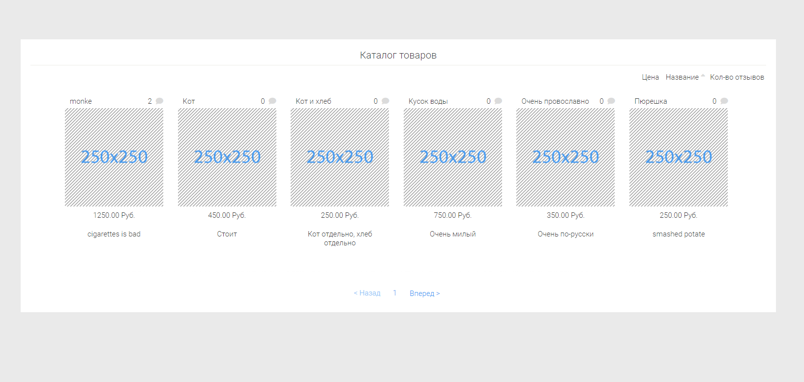

# Basic MVC pattern implementation

    

## Features:
- Products catalog with pagination and sorting
- Basic review system
- Admin panel:
  - Managing products 
  - Moderating reviews
  - DB fixing
- Animations in admin panel sections 

## How to run
To run you need some server (open server, for example), and mysql db.  
DB settings are stored in `.application/config.php`, sql dump in `misc/tdb_stajer_khram.sql`.